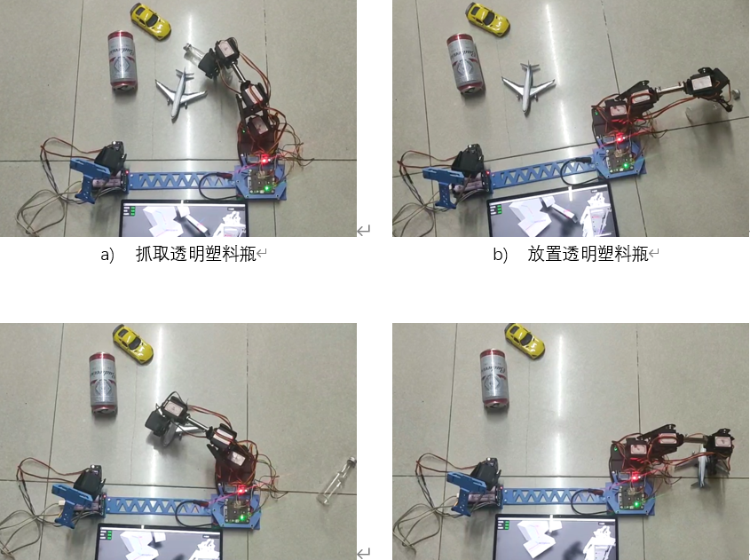

# GraduationArmSystem
 毕设-基于远程监控机械臂的透明物体检测抓取

## 说明
- 包含**服务端（Server）、视觉（Vision）、机械臂（MCU）、图形界面（godot）** 四个项目
- **服务端**：需求python3.7，详细配置参考[DREDS](https://github.com/PKU-EPIC/DREDS/tree/main/CatePoseEstimation)
- **视觉**：为ROS的节点，ros run xxx ClientVision即可，需要奥比中光在ROS平台的SDK
- **机械臂**：为MicroPython项目，基于ESP32，需要将其中必要文件用ampy上传至单片机，运行main.py即可
- **图形界面**：使用[Godot Engine](https://github.com/godotengine/godot/)的4.0.3 RC1版本开发，该引擎开源免费，支持3D、2D和全平台导出，使用类python的脚本语言或C#开发

## 注意
- 在Server\cate_pose_estimation\model中需要名为checkpoint-iter-00150000.pth的模型文件，来源于 [DREDS](https://github.com/PKU-EPIC/DREDS/tree/main/CatePoseEstimation) 作者提供的 [下载链接](https://drive.google.com/file/d/1MqUIUhJYLljnoj66mjiyq36VxZHUYQ77/view)

- 在Server\depth_restoration\model中需要名为model.pth的模型文件，来源于 [DREDS](https://github.com/PKU-EPIC/DREDS/tree/main/CatePoseEstimation) 作者提供的 [下载链接](https://mirrors.pku.edu.cn/dl-release/DREDS_ECCV2022/checkpoint/SwinDRNet/models/model.pth)

## 演示

- **工作流程与技术说明**

- **抓取演示**：

- **2D BBox 视图**：

- **位姿Box 视图**：

- **3D空间 视图**：

